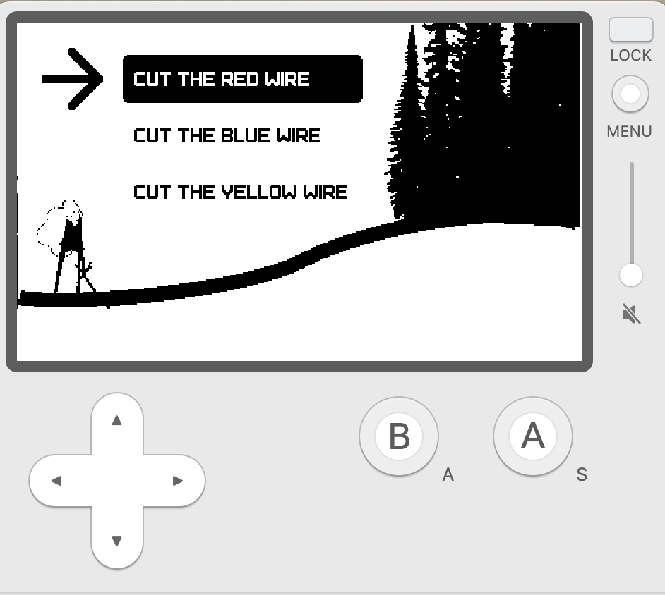

# aloha-moon

This is a short series of hello world type examples in Lua on the Playdate console to help learn the language.

When I first heard the name lua, I thought it might Hawaiian as in luau! But it's actually Portuguese meaning "moon". You can learn more about the origin on the [lua wiki](<https://en.wikipedia.org/wiki/Lua_(programming_language)>)

## Challenges

Each of these examples are more like challenges since I didn't know how to accomplish them before writing each one. I may not actually complete each challenge but hopefully I'll at least learn something new during the struggle.

#### 1. Hello Playdata

what can I do with the sample lua playdate code from [writing a game](https://sdk.play.date/2.0.3/Inside%20Playdate.html#_writing_a_game)? Can I draw a background, a player (that acts like a cursor), and series of options that the player can stand next to and select?

folder: challenges > 1-hello-playdate

#### Artists

[headwinds](https://github.com/headwinds) is primarily a fronted dev with Javascript as most comfortable language, and will be attempting to adapt many common patterns from web dev to lua.

#### Credits

This is full list of credits - each folder has its own readme with a further breakdown of where each of these were used.

- [panels](https://github.com/cadin/panels/tree/main)
- [2048](https://github.com/hteumeuleu/2048)
- [wanda](https://www.pinterest.ca/pin/337910778306440720/)

#### More Learning Playdate Resources

- [SquidGodDev](https://github.com/SquidGodDev)
