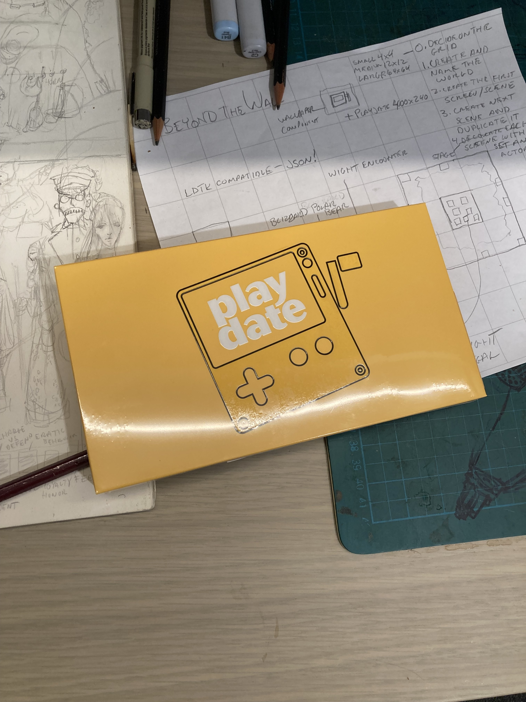
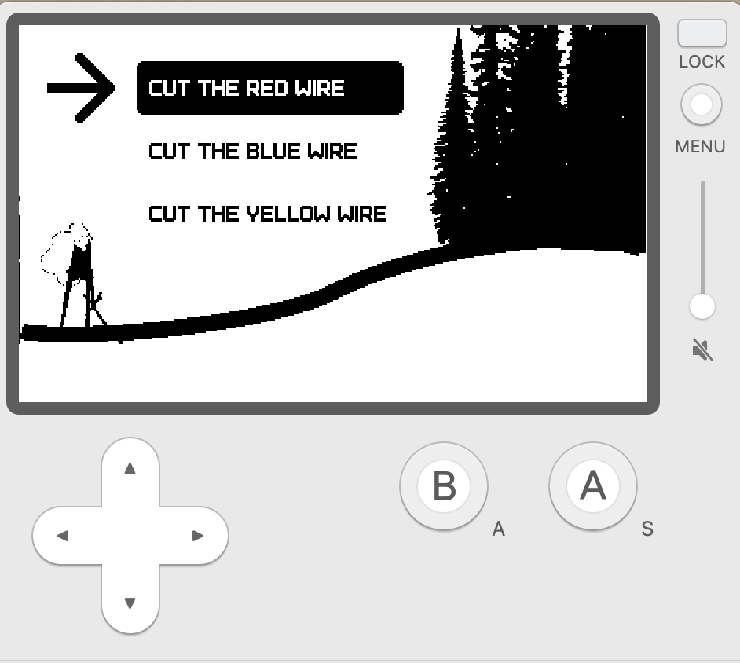

# aloha-moon

This is a short series of Lua & Playdate examples that build off each other. By mastering all seven challenges, one should confident enough to build their own game.

When I first heard the name lua, I thought it might be Hawaiian in origin; as in luau! But it's actually Portuguese meaning "moon". You can learn more about the origin on the [lua wiki](<https://en.wikipedia.org/wiki/Lua_(programming_language)>)

### VS Code

I'm using VS Code to build this project which is made possible by [pddx](https://github.com/colingourlay/pddx).

```
npm install
npm start
```

Much thanks to [playdate-metroidvania](https://github.com/colingourlay/playdate-metroidvania) for this familar setup

## Challenges

Each of these examples are more like challenges since I didn't know how to accomplish them before writing each one. I may not actually complete each challenge but hopefully I'll at least learn something new during the struggle.

#### 1. Hello



what can I do with the sample lua playdate code from [writing a game](https://sdk.play.date/2.0.3/Inside%20Playdate.html#_writing_a_game)? Can I draw a background, a player (that acts like a cursor), and series of options that the player can stand next to and select?

folder: challenges > 1-hello-playdate

#### 2. Tile

coming soon

#### 3. Grid

coming soon

#### 4. Hud

coming soon

#### 5. Encounter

coming soon

#### 6. Effects

How do imagetables work and how can I use them to create a simple animation? Let's animate lightning!

#### 7. Levels

An exploration of the LDTK and how I have used to built a Game of Thrones inspired world.

[walkthrough](./source/challenges/7-levels/ldtk-walkthrough.md)

#### Artists

[headwinds](https://github.com/headwinds) is primarily a fronted dev with Javascript as most comfortable language, and will be attempting to adapt many common patterns from web dev to lua.

#### Credits

This is full list of credits - each folder has its own readme with a further breakdown of where each of these were used.

- [panels](https://github.com/cadin/panels/tree/main)
- [2048](https://github.com/hteumeuleu/2048)
- [wanda](https://www.pinterest.ca/pin/337910778306440720/)
- [AnimatedSprite](https://github.com/Whitebrim/AnimatedSprite)

#### More Learning Playdate Resources

- [SquidGodDev](https://github.com/SquidGodDev)

#### Fun

- [origin of hello world](https://www.tiktok.com/@vscode/video/7275525548443553070?_r=1&_t=8fS168YLR0X)
- [Typescript to Lua Roguelike](https://gist.github.com/anderoonies/20fa9eb8ade544d07cc4a65f4a56d4d60)
- [PlaydateSDK with Typescript](https://devforum.play.date/t/playdate-sdk-with-typescript/369/3)

#### Captain's log

My [journey](./captains_log/playdate_dev_log.md) to discovering lua and the playdate console
